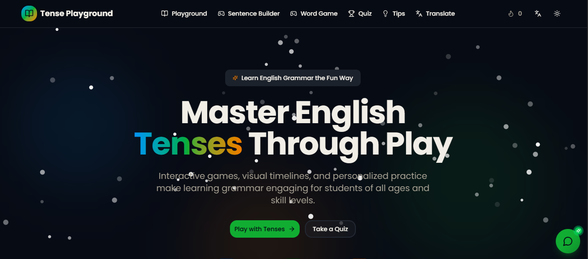

#  Sabai: The Ultimate Language Learning Platform

**Sabai** (formerly TensePlay) is a state-of-the-art, AI-powered English learning ecosystem designed to make grammar mastery effortless, engaging, and philanthropic. Built with **Next.js 16**, **Google Gemini 2.5**, and **Firebase**, Sabai combines premium education with a mission to support the **Sabai Foundation**.



## ✨ Core Pillars

### 🤖 Hyper-Intelligent AI (Gemini 2.5)
*   **Tensey Tutor**: A warm, encouraging AI assistant that helps students practice conversation and corrects grammar in real-time.
*   **Recursive Analyzer**: Deep-dives into any sentence to identify tenses, breakdown structures, and provide alternative suggestions.
*   **Smart Word of the Day**: A dynamically generated, CEFR-aligned vocabulary booster using a 20-key rotating AI pool for maximum reliability.

### 🎮 Gamified Mastery
*   **Playground & Quiz**: Explore all 12 English tenses through interactive drills and multiple difficulty levels.
*   **Sentence Builder**: Drag-and-drop word sequencing to master syntax.
*   **Word Rainfall**: A high-speed arcade game where you catch falling words to form perfect sentences.
*   **Streak & Level System**: Track your progress with XP, CEFR level-ups, and a 10x improved personalized onboarding flow.

### 💎 Premium & Philanthropy
*   **Sabai Foundation Support**: A integrated donation system where users can support underprivileged education.
*   **Manual UPI Verification**: A secure, manual payment workflow where users submit transaction IDs for admin approval.
*   **Energy System**: Balanced learning with energy refills, unlocked for premium supporters.

---

## 🛠️ Tech Stack & Architecture

Sabai is split into two primary components:

1.  **Main Application**: The learner's portal (Progressive Web App).
    *   *Next.js 16 (App Router), Tailwind CSS, Framer Motion, Firebase SDK.*
2.  **Admin Command Center**: A restricted management dashboard for staff.
    *   *Located in `/admin-dashboard-app`.*
    *   *Enforces strict admin-only Firebase security rules.*

---

## 🚀 Installation & Setup

### 1. Main Application
```bash
# Clone the repo
git clone <repository-url>
cd tense-playground

# Install and build
npm install
npm run dev
```

### 2. Admin Dashboard
```bash
cd admin-dashboard-app
npm install
npm run dev
```

### 🔑 Environment Variables (.env.local)
Sabai uses a sophisticated 20-key rotating pool for Google Gemini to ensure near-zero downtime.
```bash
# Gemini API Pool
GEMINI_API_KEY_1=your_key_1
...
GEMINI_API_KEY_20=your_key_20

# Firebase Configuration
NEXT_PUBLIC_FIREBASE_API_KEY=...
NEXT_PUBLIC_FIREBASE_PROJECT_ID=...
...
```

---

## 🛡️ Security Infrastructure
Sabai uses **Recursive Firestore Security Rules** to ensure data integrity:
*   **User Isolation**: Learners can only access their own sessions and analytics.
*   **Admin Lockdown**: Subscription approvals and global settings are strictly restricted to whitelisted admin emails.
*   **Public API Access**: AI caches (like word of the day) are optimized for public cloud-function writing.

## 🤝 Contributing
Sabai is a platform for the community. If you are interested in improving the AI tutors or adding new game modes, please submit a Pull Request!

---

**Made with ❤️ for the learners of today and the leaders of tomorrow.**
*© 2026 Sabai Foundation*
